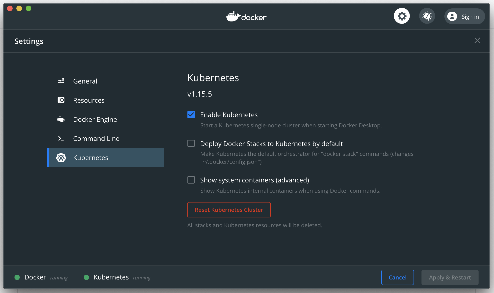

## Spring Reactive Groovy Example

A demo app to show how to setup Reactive Spring on Netty, written in Groovy.

### Build Application Jar
```bash
$ ./gradlew build
```

### Build Docker Image
```bash
$ DOCKER_BUILDKIT=1 docker build -t com.example/hello-world:1.0.0 .
```

## Deploy to Local Kubernetes

### Install Kubernetes
1. Install Docker for Desktop from here: https://www.docker.com/products/docker-desktop
2. Activate Kubernetes in Docker preferences (takes 5-10 minutes the first time):

3. Confirm Kubernetes installation:
```bash
$ kubectl cluster-info
Kubernetes master is running at https://kubernetes.docker.internal:6443
KubeDNS is running at https://kubernetes.docker.internal:6443/api/v1/namespaces/kube-system/services/kube-dns:dns/proxy
```
