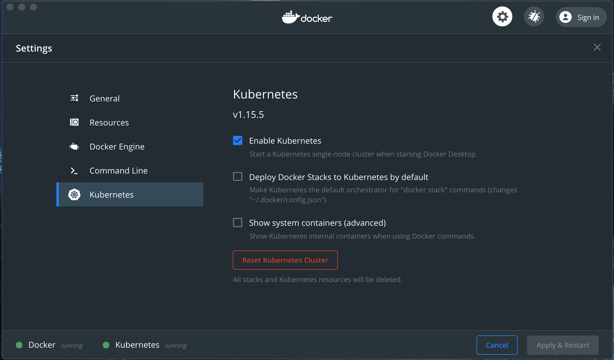

## Spring Reactive Groovy Example

A demo app to show how to setup Reactive Spring on Netty, written in Groovy.

### Build Application Jar
```bash
$ ./gradlew build
```

### Build Docker Image
```bash
$ DOCKER_BUILDKIT=1 docker build -t com.example/hello-world:1.0.0 .
```

## Deploy to Local Kubernetes

### Install Kubernetes
1. Install Docker for Desktop from here: https://www.docker.com/products/docker-desktop
2. Activate Kubernetes in Docker preferences (takes 5-10 minutes the first time):

3. Confirm Kubernetes installation:
```bash
$ kubectl cluster-info
Kubernetes master is running at https://kubernetes.docker.internal:6443
KubeDNS is running at https://kubernetes.docker.internal:6443/api/v1/namespaces/kube-system/services/kube-dns:dns/proxy
```

### Create Kubernetes Deployment
1. Generate YAML:
```bash
$ mkdir .kube
$ kubectl create deployment hello-world --image=com.example/hello-world:1.0.0 --dry-run -o yaml >.kube/deployment.yaml
$ cat .kube/deployment.yaml
apiVersion: apps/v1
kind: Deployment
metadata:
  creationTimestamp: null
  labels:
    app: hello-world
  name: hello-world
spec:
  replicas: 1
  selector:
    matchLabels:
      app: hello-world
  strategy: {}
  template:
    metadata:
      creationTimestamp: null
      labels:
        app: hello-world
    spec:
      containers:
      - image: com.example/hello-world:1.0.0
        name: hello-world
        resources: {}
status: {}
```
2. Apply deployment:
```bash
$ kubectl apply -f .kube/deployment.yaml
deployment.apps/hello-world created
```

### Forward Deployment Port and Test
```bash
$ kubectl port-forward deployment/hello-world 8080
Forwarding from 127.0.0.1:8080 -> 8080
Forwarding from [::1]:8080 -> 8080
```
Test the application by browsing to http://localhost:8080

### Scale the Deployment
```bash
$ kubectl scale deployment/hello-world --replicas=2
deployment.extensions/hello-world scaled
```

### Create Kubernetes Load Balancing Service
1. Generate YAML:
```bash
$ kubectl create service clusterip hello-world --tcp=8080:8080 --dry-run -o yaml >.kube/service.yaml
$ cat .kube/service.yaml
apiVersion: v1
kind: Service
metadata:
  creationTimestamp: null
  labels:
    app: hello-world
  name: hello-world
spec:
  ports:
  - name: 8080-8080
    port: 8080
    protocol: TCP
    targetPort: 8080
  selector:
    app: hello-world
  type: ClusterIP
status:
  loadBalancer: {}
```
2. Apply service:
```bash
$ kubectl apply -f .kube/service.yaml
service/hello-world created
```

### Forward Service Port and Test
```bash
$ kubectl port-forward svc/hello-world 8080
Forwarding from 127.0.0.1:8080 -> 8080
Forwarding from [::1]:8080 -> 8080
```
Test the application by browsing to http://localhost:8080

### Create Kubernetes NGINX Ingress
1. Install NGINX Ingress Controller (see: https://kubernetes.github.io/ingress-nginx/deploy/):
```bash
$ kubectl apply -f https://raw.githubusercontent.com/kubernetes/ingress-nginx/nginx-0.29.0/deploy/static/mandatory.yaml
$ kubectl apply -f https://raw.githubusercontent.com/kubernetes/ingress-nginx/nginx-0.29.0/deploy/static/provider/cloud-generic.yaml
```
2. Create the file .kube/ingress.yaml:
```bash
$ cat .kube/ingress.yaml
apiVersion: networking.k8s.io/v1beta1
kind: Ingress
metadata:
  name: hello-world
spec:
  backend:
    serviceName: hello-world
    servicePort: 8080
```
3. Apply ingress:
```bash
$ kubectl apply -f .kube/ingress.yaml
ingress.networking.k8s.io/hello-world created
```
